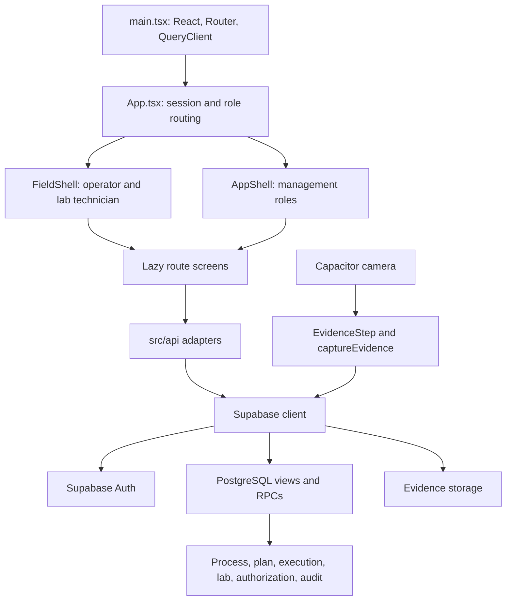

# Workspace map — 12 September 2026

This is a navigation and implementation inventory of the local working tree, not a replacement process specification or a deployment certification. Paths below are relative to `T:\exisiting_freshbowl\exisiting_freshbowl` unless otherwise stated.

## 1. Folder map

```text
T:\exisiting_freshbowl\          outer workspace; contains .claude and another folder of the same name
  exisiting_freshbowl\          actual project collection
    freshbowl_os\              main Git repository
      CLAUDE.md / README.md    project rules and human entry point
      docs\                    current contracts, process, task board, audits, history
      mushroomos\              runnable application and database source
        src\                   React application
        supabase\migrations\   PostgreSQL schema, functions, views and security
        supabase\seed\         reference, process, lab and demo data
        tests\                 integration, contract and UI checks
        scripts\               database tooling, probes, demo and verification utilities
        android\               Capacitor Android host
        public\                web manifest and static assets
        dist\ / dist-audit\    generated web output
        node_modules\          installed dependencies
      scripts\                 schema snapshot and documentation archive utilities
      mails\                   source batch reports, schedules, SOPs and lab documents
      apk_extracted\           extracted APK material
      MushroomOS-extracted\    extracted assets
      *.apk / *.zip            packaged application and archive artifacts
    manus_frontend\            separate React prototype with optional backend adapter
      client\                  prototype UI source
      server\index.ts          Express static-file server, not the workflow engine
      shared\ / patches\      prototype support
      frontend\                nested duplicate client and package/config files
      dist\                    generated prototype output
    docs_for_reading\          supplied PRDs, process markdown, spreadsheets and lab document
    image_for_dummy_batch\     sample image for dummy data
    MushroomOS.apk             packaged app; relationship to current source not verified
    emu*.png                   saved emulator screenshots
    gradle-trace.txt           build log
    manus.md.txt               prototype-related text
```

The main code is **`freshbowl_os/mushroomos`**, not the outer workspace and not `manus_frontend`. There is no root package orchestrating these as one application.

The repository also contains `.claude`, `.kiro`, `.vscode`, `.mcp.json`, `key.txt` and `memory.zip`; the app contains `.env.local`. Their presence was inventoried without reading credential contents. External project memory is referenced at `T:\obsidian\memory`; it was not inspected or changed in this mapping session.

## 2. Product and process

MushroomOS manages button-mushroom compost production at Fresh Bowl Horticulture: choose a process version, generate a batch plan from H0, assign work and resources, capture execution and photographs, record laboratory results, obtain decisions, release gates, and show variance and forecast.

The latest root rules describe this chain:

```text
PROCESS CATALOGUE → PROCESS VERSION → BATCH → H0 → GENERATED BASELINE
STANDARD → PLAN → ACTUAL + AUTHORIZATION → FORECAST / MANAGEMENT
```

Five intended invariants:

1. Activation freezes the plan.
2. Actuals are append-only; corrections supersede with a reason.
3. Extensions remain separate from planned and actual ends.
4. Process rules are versioned data.
5. Screens read views and write through RPCs; current source still has exceptions to the read rule.

`docs/01-process/STANDARD.md` describes PROCESS-2026C: the main pre-Turner rail reaches H174; the first discharge reaches H470; the other streams discharge at H472 and H474. Thus H470 is not the completion time of every stream. Straw preparation and nitrogen/mineral preparation converge with the main rail. Turner rest gates operate per pile.

470 is specific to the current process version, not a universal application constant. Read `v_process_catalogue.standard_hr`; `baseline_hours` is the day grid and has a different meaning. Four factory questions remain explicitly unresolved: loader resource modelling, Turner changeover time, receiving bunker on reload, and the 67–68% moisture band.

## 3. Runtime architecture



Main stack: React 18.3.1, TypeScript 5.7.2, Vite 6.0.7, React Router 6, TanStack Query 5, Supabase JS 2.47.10, Tailwind 3, Capacitor 6 and ExcelJS. Versions are from the local package manifest.

`src/main.tsx` installs the router and query provider and starts effective-clock synchronization. Query defaults include 30-second stale time, focus refresh and one retry. `src/api/client.ts` creates the shared Supabase client and requires `VITE_SUPABASE_URL` and `VITE_SUPABASE_ANON_KEY`.

`src/lib/auth.ts` reads `app_metadata.app_role` from the session token, with a profile fallback for routing. The database is the authorization boundary; route guards are navigation controls. Operator and lab technician receive the field shell; supervisor retains management navigation even on a field route.

`src/lib/now.ts` fetches `get_effective_now` and stores an offset for display. Failed synchronization falls back to browser time. Do not infer authoritative write timestamps from this display helper.

## 4. Screen and module map

Paths in this section are relative to `freshbowl_os/mushroomos`.

| Area | Routes / entry screens | Main supporting modules |
|---|---|---|
| Login and role landing | `/sign-in`, `/` | `src/lib/auth.ts`, `src/App.tsx` |
| Admin intake | `/admin`, `/admin/batch/start`, `/admin/batch/ongoing` | `AdminHome`, `BatchStart`, `api/intake.ts`, `api/process.ts`, `api/batch.ts` |
| Preparation and historical onboarding | `/admin/batch/:id/prepare`, `/admin/batch/:id/onboard` | `PrepareBatch`, `OnboardBatch`, `BulkAssign`, `api/prebatch.ts` |
| Legacy creation and plan | `/admin/batch/new`, `/admin/batch/:id/schedule` | `NewBatch`, `ScheduleBuilder`, `api/schedule.ts` |
| Schedule and batch lists | `/admin/today`, `/admin/batches`, `/admin/schedule` | `api/adminToday.ts`, `api/batches.ts`, `api/monthlySchedule.ts`, `lib/monthlyScheduleImport.ts` |
| Batch management | `/batch/:id` | `BatchPage`, `api/batchPage.ts`, timeline/event/variance components |
| Operator | `/operator/my-work` | `MyWork`, `TaskDrawer`, `api/work.ts`, `api/batch.ts` |
| Laboratory | `/lab/queue`, `/lab/checkpoint/:activityId` | `LabQueue`, `LabCheckpoint`, `api/lab.ts`, shared field components |
| Decisions | `/lab/approvals` | `LabApprovals`, `api/lab.ts` |
| Supervisor | `/supervisor/control-room` | `ControlRoom`, `api/controlRoom.ts` |
| Resources | `/manager/resources`, `/plant` | `Resources`, `Plant`, `api/plant.ts`, `api/movements.ts` |
| Management overview | `/gm/control-tower` | `ControlTower`, `api/tower.ts` |
| Process/reference inspection | `/admin/process-explorer`, `/admin/reference` | `ProcessExplorer`, `ReferenceData`, `api/processDefinition.ts` |
| Development gallery | `/dev/gallery` in development only | `Gallery`, fixtures, visualization components |

Compatibility redirects preserve `/admin/batch/:id` and `/gm/command-center`. `BatchDetail`, `TaskDrawer` and `Pending` are source files, not independent routes declared in `App.tsx`; a filename in `routes/` does not necessarily mean a routable page.

Role restrictions differ by route. For example, new/ongoing batch creation admits admin and GM; preparation/onboarding also admit supervisor. Lab queue/checkpoint admit lab technician and supervisor. The approval page admits management roles, while the RPC decides actual decision authority.

Shared code:

- `src/domain/`: types, contract types, time projection, labels and cardinality.
- `src/components/layout/`: management and field shells and page headings.
- `src/components/field/`: evidence capture, errors and lab wording.
- `src/components/admin/BulkAssign.tsx`: assigns unassigned activities by role through per-row calls.
- `src/components/composite/`: staircase calendar, hour rail, movements, events and exceptions.
- `src/components/domain/`, `node/`, `primitives/`: reusable display elements.
- `src/theme/tokens.css`, `src/index.css`: visual system.

## 5. Main write/read flows

| Flow | Observed contract path |
|---|---|
| New batch | process catalogue → `factory_instant` → `create_master_batch` → `generate_activity_plan` |
| Prepare and activate | incoming sample/results → acceptance → `assign_activity` → `validate_batch` → `activate_batch` |
| Operator work | `v_my_work` → `start_activity` → evidence → finish; current `TaskDrawer` still calls `submit_activity` |
| Lab capture | queue/work views → `start_activity` → `open_lab_sample` → `request_lab_test` → `record_lab_result` → evidence → `complete_activity` |
| Lab decision | approval views → `decide_lab_submission`; database gate progression is distinct from merely recording results |
| Evidence | native camera or web picker → local image-header check → upload to `evidence` bucket → `bind_evidence` → signed URL for display |
| Ongoing batch onboarding | stated historical data through `submit_activity`, and correction/start helpers; missing historical evidence can leave work incomplete |
| Management reads | live-batch, variance, contributor, event, lab-gate and forecast views, plus remaining direct table reads |

Important read models include `v_process_catalogue`, `v_my_work`, `v_evidence_state`, `v_lab_queue`, `v_lab_result_history`, `v_lab_gate`, `v_lab_approval_queue`, `v_batch_forecast`, `v_live_batch`, `v_batch_variance`, `v_variance_contributor` and `v_batch_event`.

`api/batch.ts` mixes planning, execution and evidence. `api/batches.ts` overlaps some batch operations. Direct table reads are visible in these and in lab, scheduling, process-definition, control-room and other modules. This confirms the documented contract-cleanup work remains relevant; it does not itself prove an authorization bypass.

## 6. Database source and tooling

The local tree contains **74 SQL migration files**, numbered through **0077**, with **0037–0039 absent**, and **14 seed SQL files**. Do not equate the highest filename with a file count or with deployed state.

Approximate migration navigation:

| Range | Subject |
|---|---|
| 0001–0033 | core schema/workflow, evidence, timing, gates, resources, lab, vessels and monthly planning |
| 0034–0036 | baseline immutability, role resolution, extension register |
| 0040–0048 | confidence, envelope/half-hour axis, PROCESS-2026C, catalogue, calculated standard and adjustments |
| 0049–0056 | append-only actuals, server-time execution, predecessor rest, lab maps/gates, evidence and forecast |
| 0057–0076 | role/grant hardening, view security, gate decisions, execution guards and regression fixes |
| 0077 | guard against audit writes when a gate poll changes nothing |

The saved `docs/SCHEMA.md` is dated 11 September and reports **59 tables, 38 views and 302 functions**. Those are snapshot claims, not a live database inspection performed during this session.

`scripts/schema-snapshot.mjs` at repository level generates that snapshot. App-level `scripts/db.mjs` reads `SUPABASE_DB_URL`, sorts SQL files and executes every file in the selected directory. It has no applied-migration ledger or skip check. It should not be treated as an automatic pending-migrations command.

Other scripts fall into four groups: `gen-*` creates process/lab definitions; `demo-*`, `dummy-*`, `stage-*`, `setup-demo-*` and cleanup scripts manipulate example state; `probe-*`, `inspect`, `forensic-audit` and `break/` investigate the database; `verify*`, `check-*` and acceptance scripts exercise behavior. Names alone do not establish read-only behavior.

## 7. Main application versus Manus prototype

| | Main app | Manus prototype |
|---|---|---|
| Location | `freshbowl_os/mushroomos` | `manus_frontend` |
| React / Vite / Tailwind | 18 / 6 / 3 | 19 / 7 / 4 |
| Routing | React Router and role guards | Wouter; lab, admin and supervisor surfaces |
| Backend | Supabase JS shared client | custom `fetch` adapter to PostgREST/RPC/storage |
| Missing configuration | app throws configuration error | typed demo fixtures |
| Authentication | session and token role handling | adapter expects `mushroomos-access-token` in localStorage; verification notes say authenticated session handling remains a prerequisite |
| Server | hosted Supabase owns business logic | Express serves static frontend files |
| Mobile | Capacitor Android project | responsive prototype screens |

All **75 files** found in `manus_frontend/client` were compared by hash with their corresponding nested `frontend/client` files: every counterpart exists and matches. This verifies that direction of the client comparison, not that both entire package folders are identical.

The nested `frontend/package.json` still references `server/index.ts` in its build command, but that nested folder has no `server` directory. Treat the outer Manus package as the complete package; the nested copy's build has not been run.

## 8. Documentation navigation and conflicts

Start at `freshbowl_os/CLAUDE.md` and `docs/00-START-HERE.md`, then use:

| Need | Location |
|---|---|
| Process timings | `docs/01-process/schedule.json`, `STANDARD.md` |
| Lab process and open inputs | `docs/01-process/lab_checkpoints.json`, LAB files and open-question files |
| Database names/signatures | `docs/SCHEMA.md` |
| Screen contracts | `docs/02-architecture/DATA-CONTRACTS.md` |
| Current tasks and defects | `docs/03-mission/TASK-BOARD.md`, `FINDINGS.md` |
| UI direction | `docs/05-ui/UI-SYSTEM.md`, `WORKSTATIONS.md`, `VISUAL-LANGUAGE.md` |
| Prior verification | `docs/04-audit/` |
| Supporting/historical material | `docs/_reference/`, `docs/_archive/` |
| Original supplied documents | sibling `docs_for_reading/` and repository `mails/` |

Conflicts observed, left unresolved rather than silently rewriting guidance:

- `ARCHITECTURE.md` still reports 36 migrations and old schema-drift reservations; the local tree has 74 files and the newer schema snapshot is substantially larger.
- `README.md` reports 76 migrations, also different from the local file count.
- `AGENT-BRIEF.md` describes blockers and overwrite defects that the newer findings document marks resolved. It also speaks of one batch as always 470 hours, whereas the root rules explicitly require version-specific standards.
- `FINDINGS.md` still lists the lab completion failure as RED; the task board records a 12 September implementation pending walkthrough, and `LabCheckpoint.tsx` now calls `completeActivity`.
- Camera/gallery findings predate the native camera implementation now in `src/lib/camera.ts`. The task board still requires APK/device sign-off.
- The architecture time discussion reflects older stated-time behavior. Use the current contracts and database evidence before changing execution semantics.

This map does not choose new factory rules or resolve those instruction conflicts. Archived instructions were inventoried, not used as current implementation requirements. Binary source documents were inventoried rather than individually extracted and reconciled.

## 9. Working state and remaining work

The last Git commit is `003d2aa`, dated 31 August 2026. The working tree contains many modified, staged and untracked files, including new routes, tests and migrations. Therefore HEAD alone is not a snapshot of this folder's current implementation. Existing changes were left intact.

Current task-board direction is a backend freeze and completion of the UI workstations. Source now includes the newer admin intake, bulk assignment, lab checkpoint and camera work. Recorded next steps include signed-in/device acceptance, the operator completion-contract change, extension request/decision UI, view-only reads and consistent screen states.

Recorded backend/deployment items include F47 (0077 written but documented as not applied), request-lab-test role guarding, cancelled-batch extension cleanup, schema drift, offline replay/idempotency, production accounts/settings and release APK validation. These are inherited findings, not fresh live probes.

No durable offline queue was found in the inspected source, and current findings explicitly say offline capture is not built. React Query retry and persisted login do not constitute an offline submission queue.

## 10. Local setup and verification boundaries

Run application commands from `T:\exisiting_freshbowl\exisiting_freshbowl\freshbowl_os\mushroomos`:

```powershell
npm run dev        # Vite, configured port 5173
npm run typecheck  # TypeScript, no emit
npm run build      # TypeScript build plus Vite; emits manifest for chunk checks
npm run preview
```

`.env.example` documents the two browser variables and the separate `SUPABASE_DB_URL` for database tooling. `capacitor.config.json` uses app ID `in.freshbowl.mushroomos`, name MushroomOS and web directory `dist`.

There are **37 top-level `tests/*.test.ts` files**, plus `src/domain/time.test.ts` and type probes. Much of the suite connects to the configured deployed database; evidence tests also touch real storage. `vite.config.ts` serializes test files and allows long database timeouts. A blanket `npm test` is not a purely local check.

This session inspected structure, manifests, routing, key runtime modules, API call sites, migration inventory, test harness, current process/mission documents and prototype duplication. **`npm run typecheck` passed (exit 0) on 12 September 2026.** It did not run database migrations, seed/demo scripts, the live integration suite, Android packaging or browser/device acceptance. Existing APKs and generated output were not assumed to represent current source.
